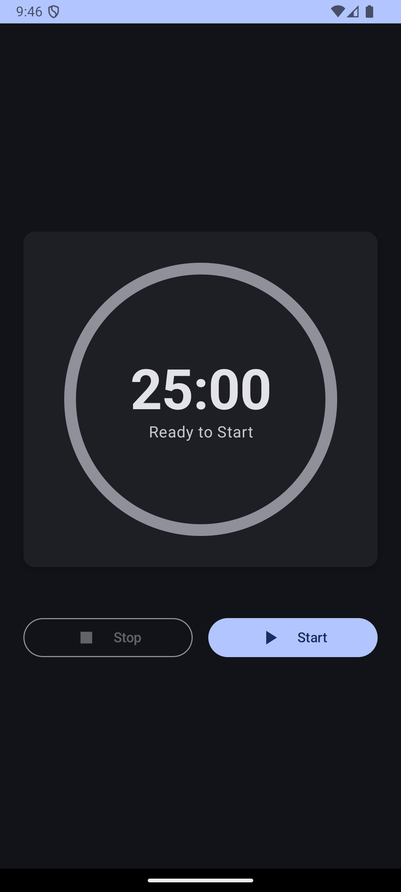

# 🍅 Pomodoro Timer - Android App

A simple, effective Pomodoro timer app for Android built with modern technologies and a focus on reliability and user experience.

## 📱 Features

### Screenshots



### Core Features (MVP)

- ✅ **Reliable background timer** - Works even when app is minimized
- ✅ **One-tap start** - Begin focus sessions instantly
- ✅ **Automatic breaks** - 5-minute breaks after work, 15-30 minute long breaks
- ✅ **Session tracking** - Daily completed pomodoro counter
- ✅ **Home screen widget** - Start/pause timer without opening app
- ✅ **Material Design 3** - Modern, accessible UI

### Planned Features

- 🔄 **Cross-device sync** - Firebase integration for multi-device support
- 📊 **Progress analytics** - Weekly and monthly productivity insights
- 🎵 **Ambient sounds** - Focus-enhancing background audio
- ⚙️ **Customizable intervals** - Adapt timing to your workflow

## 🛠️ Tech Stack

- **Language:** Kotlin 1.9.22
- **Java:** JDK 17
- **UI Framework:** Jetpack Compose 2024.02.00
- **Architecture:** MVVM + Clean Architecture
- **Dependency Injection:** Hilt 2.48
- **Database:** Room 2.6.1 (local) + Firestore (sync)
- **Background Tasks:** WorkManager 2.9.0 + Foreground Service
- **Widgets:** Jetpack Glance 1.0.0
- **Design:** Material Design 3
- **Testing:** JUnit 4, Mockito, Turbine, Truth

## 🚀 Getting Started

### Prerequisites

- Android Studio Hedgehog (2023.3.1) or later
- Android SDK API 24+ (Android 7.0)
- Kotlin 1.9.22+
- Java 17 (JDK 17)

### Setup

1. **Clone the repository**

   ```bash
   git clone https://github.com/yourusername/pomodoro-timer-android.git
   cd pomodoro-timer-android
   ```

2. **Open in Android Studio**
   - Open Android Studio
   - Select "Open an existing project"
   - Choose the cloned directory

3. **Build and run**

   ```bash
   ./gradlew clean build
   ```

### Testing

```bash
# Run unit tests
./gradlew test

# Run integration tests
./gradlew connectedAndroidTest

# Run all tests
./gradlew check
```

### Firebase Setup (Optional)

For cross-device sync functionality:

1. Create a Firebase project at [Firebase Console](https://console.firebase.google.com/)
2. Add your Android app to the project
3. Download `google-services.json` and place it in `app/` directory
4. Enable Firestore and Authentication in Firebase Console

## 📁 Project Structure

```
app/src/main/java/com/smirnoffmg/pomodorotimer/
├── data/                   # Data layer
│   ├── local/             # Room database, DAOs, entities
│   ├── remote/            # Firebase integration
│   └── repository/        # Repository implementations
├── domain/                # Business logic
│   ├── model/             # Domain models
│   ├── repository/        # Repository interfaces
│   └── usecase/           # Use cases
├── presentation/          # UI layer
│   ├── ui/screens/        # Compose screens
│   ├── ui/components/     # Reusable UI components
│   ├── ui/theme/          # Material 3 theming
│   ├── viewmodel/         # ViewModels
│   └── navigation/        # Navigation setup
├── service/               # Background services
│   └── timer/             # Timer foreground service
├── widget/                # Home screen widgets
├── di/                    # Dependency injection modules
└── worker/                # WorkManager workers

app/src/test/              # Unit tests
├── java/com/smirnoffmg/pomodorotimer/
│   ├── testing/           # Test infrastructure
│   ├── presentation/      # ViewModel tests
│   ├── domain/            # Use case tests
│   ├── data/              # Repository tests
│   └── di/                # Test modules

app/src/androidTest/       # Integration tests
├── java/com/smirnoffmg/pomodorotimer/
│   ├── testing/           # Test runners
│   └── presentation/      # UI tests
```


## 🎯 Development Roadmap

### Phase 1: Core Timer System ✅

- [x] Project setup and dependencies
- [x] Clean Architecture implementation
- [x] Comprehensive testing infrastructure
- [x] Dependency injection setup
- [x] Foreground service timer
- [x] Basic Compose UI
- [x] Start/pause/stop functionality

### Phase 2: Essential Features 🔄

- [ ] Session management and tracking
- [ ] Automatic work/break transitions
- [ ] Notification system
- [ ] Room database integration

### Phase 3: Widget & Polish 📅

- [ ] Home screen widget implementation
- [ ] Settings and customization
- [ ] Accessibility improvements
- [ ] UI/UX polish

### Phase 4: Release 🚀

- [ ] Firebase integration
- [ ] Cross-device synchronization
- [ ] Play Store preparation
- [ ] Beta testing and feedback

## 🤝 Contributing

Contributions are welcome! Please feel free to submit a Pull Request. For major changes, please open an issue first to discuss what you would like to change.

### Development Guidelines

- Follow [Android's coding standards](https://developer.android.com/kotlin/style-guide)
- **Write tests for new features** (TDD approach)
- Ensure UI follows Material Design 3 guidelines
- Test on multiple Android versions (API 24+)
- Follow SOLID, DRY, and KISS principles

### Testing Requirements

- **Unit tests** for all business logic
- **Integration tests** for UI flows
- **Test coverage** should be maintained above 80%
- **Test naming** should follow Given-When-Then pattern

## 📄 License

This project is licensed under the MIT License - see the [LICENSE](LICENSE) file for details.

## 🙏 Acknowledgments

- [Francesco Cirillo](https://francescocirillo.com/) - Creator of the Pomodoro Technique
- [Material Design 3](https://m3.material.io/) - Design system
- [Android Jetpack](https://developer.android.com/jetpack) - Modern Android development

## 📞 Support

If you have any questions or run into issues:

- 🐛 [Report bugs](https://github.com/smirnoffmg/Pomodoro/issues)
- 💡 [Request features](https://github.com/smirnoffmg/Pomodoro/discussions)

---

**Built with ❤️ for productivity enthusiasts**

